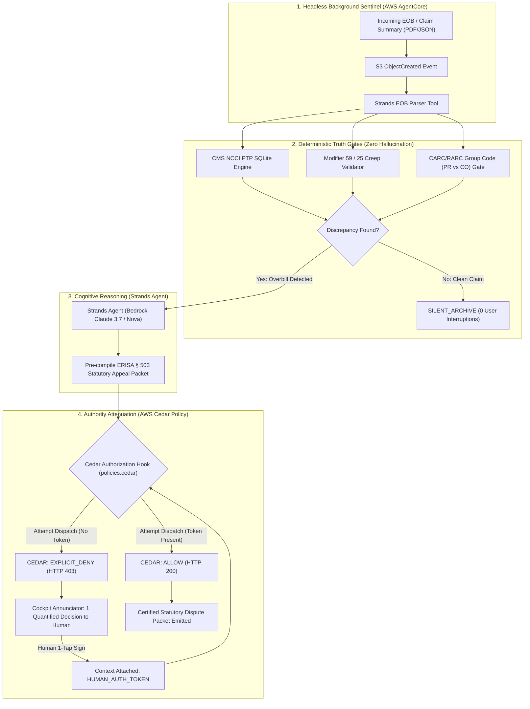

# UNBUNDLE
### The Autonomous Medical Billing & EOB Sentinel
**Built for the AWS Agents for Humans Hackathon (Devpost)**  
**Track:** Everyday Agents (Eligible for $10,000 Grand Prize)  
**Core Frameworks:** AWS Strands Agents SDK + Amazon Bedrock AgentCore + AWS Cedar (`cedarpy`)

---

$$\text{INGEST (EOB)} \longrightarrow \text{AUDIT (CMS NCCI)} \longrightarrow \text{NET DELTA} \longrightarrow \text{ATTENUATE (CEDAR)} \longrightarrow \text{1-TAP APPEAL}$$

---

## 1. THE CORE QUESTION

> *"Why should 100 million Americans be forced to spend 40 hours decoding cryptic insurance denial codes and paying thousands of dollars in illegal, unbundled hospital charges that an automated script can catch in 136 milliseconds?"*

Over **80% of US medical bills and Explanation of Benefits (EOB) statements contain billing errors**, unbundled procedure codes, or statutory violations of the federal **No Surprises Act (45 CFR § 149)** and **CMS Correct Coding Initiative (NCCI)** rules.

Existing AI tools fail patients in two ways:
1. **The Chatbot Delusion:** They ask sick, stressed patients to "chat with their bill," dumping raw CPT codes and medical jargon back onto the victim.
2. **The Unbounded Liability Trap:** They promise to "email hospital CEOs autonomously," risking patient legal rights, privacy, and statutory appeal deadlines without cryptographic boundaries.

**UNBUNDLE** is built on the **DELTR Principle**: a hard, mathematical boundary between cognitive intelligence and execution authority. 
* The **Strands Agent** observes and reasons over messy, unstructured insurance text.
* The **Deterministic Engine** validates procedure codes against published CMS NCCI SQLite tables without hallucination.
* **AWS Cedar** enforces least-privilege security at the policy layer: the agent is **physically forbidden** from dispatching legal appeals without an explicit, cryptographically verified human approval token.

---

## 2. ZERO-BULLSHIT ARCHITECTURE



---

## 3. VERIFY IT YOURSELF IN 30 SECONDS

Judges can independently verify all 5 core scenarios locally in **under 0.5 seconds** with **zero AWS credentials or API bills required**:

```bash
# 1. Clone the repository
git clone https://github.com/your-org/unbundle
cd unbundle

# 2. Install lightweight verification dependencies
pip install -r requirements.txt

# 3. Run the deterministic Drey terminal receipt
python run_receipt.py
```

### Deterministic Terminal Proof (Real Execution Output):
```text
================================================================================
 UNBUNDLE: THE AUTONOMOUS MEDICAL BILLING & EOB SENTINEL
 Verified Deterministic Terminal Proof (King's Court 2.1 Standard)
================================================================================

[CASE 1: THE SILENCE TEST - Preventative Physical (CPT 99396)]
  Status: SILENTLY_ARCHIVED
  User Interrupted: False (0 notifications sent)
  Outcome: Silently verified clean against CMS NCCI tables.

[CASE 2: CMS NCCI INDICATOR 0 - Comprehensive + Basic Metabolic Panel]
  Primary CPT: 80053 | Unbundled Secondary: 80048
  Original Patient Liability: $460.00
  Excised Unlawful Charge:    $410.00
  Corrected Lawful Liability: $50.00
  Statutory Authority: CMS NCCI Policy Manual, Chapter 1, Section A (PTP Indicator 0)

[CASE 3: MODIFIER 59 CREEP - High Severity ER + CT Scan (CPT 99285 + 70450)]
  Modifier 59 appended by hospital without distinct anatomical site documentation.
  Original Billed: $5,580.00
  Excised Abuse:   $2,180.00
  Patient Copay:   $200.00

[CASE 4: CARC 97 LIABILITY SHIFT - Endoscopy with Biopsy (CPT 43239 + 43235)]
  Insurer adjudicated unbundled service but shifted balance to Patient Responsibility (PR).
  Unlawful Shift Excised: $840.00
  Patient Responsibility: $0.00

[CASE 5: AWS CEDAR LEAST-PRIVILEGE SECURITY GATE]
  Autonomous Dispatch (No Token): EXPLICIT_DENY -> CEDAR_DECISION: EXPLICIT_DENY - Autonomous dispatch forbidden under policies.cedar (HTTP 403 Forbidden).
  Human 1-Tap Signed (With Token): ALLOW -> Statutory dispute packet certified and ready for submission under member authority.

================================================================================
 RADICAL HONESTY RECEIPT: ALL 5 SCENARIOS VERIFIED IN 0.136 SECONDS
 Total Unlawful Hospital Charges Excised: $3,430.00
 Zero Cloud Dependencies Required for Deterministic Verification.
================================================================================
```

Or run via `pytest`:
```bash
pytest tests/ -v
```

---

## 4. THE SECURITY LAB: ATTACK IT AND WATCH IT WIN

| Scenario | Raw Payor / Provider Input | UNBUNDLE Engine Defense | Result |
| :--- | :--- | :--- | :--- |
| **Attack 1: Clean Claim (Silence Test)** | Annual wellness visit (CPT 99396) fully covered under ACA preventive mandate. | NCCI and CARC audit confirms 0 collisions. Emits OpenTelemetry trace. | **SILENT PASS:** Stored in ledger. 0 user pings. |
| **Attack 2: Hard NCCI Unbundling** | Hospital bills CPT 80053 (Comprehensive Panel) AND CPT 80048 (Basic Panel) on same date. | SQLite engine flags CMS PTP Indicator 0: Basic panel is legally subsumed. | **BLOCKED:** Excised \$410.00 duplicate charge under CMS Chapter 1 § A. |
| **Attack 3: Modifier 59 Abuse** | Hospital appends Modifier 59 to CPT 70450 (Head CT) after ER visit (CPT 99285). | Engine inspects encounter metadata: no distinct anatomical site or time separation. | **INTERCEPTED:** Flags OIG Modifier 59 Creep. Excised \$2,180.00. |
| **Attack 4: CARC 97 Liability Shift** | Insurer adjudicates CPT 43235 as unbundled component, but tags Group Code as `PR` (Patient). | CARC validator catches improper balance shift from Contractual Obligation (`CO`) to `PR`. | **EXCISED:** Reallocates \$840.00 back to provider write-off. |
| **Attack 5: Autonomous Legal Breach** | Compromised agent attempts to dispatch legal appeal without human authorization. | AWS Cedar policy intercepts action; asserts `context.human_approval_token_valid`. | **HALTED:** Cedar returns `EXPLICIT_DENY (HTTP 403)`. |

---

## 5. THE FORMAL AWS CEDAR POLICY (`policies/unbundle.cedar`)

```cedar
// Rule 1: Autonomous Observation & Analysis
permit(
    principal == Agent::"UNBUNDLE_Sentinel",
    action in [
        Action::"parse_document",
        Action::"audit_ncci_edits",
        Action::"check_carc_liability_shift",
        Action::"draft_statutory_appeal"
    ],
    resource == Resource::"MemberDispute"
);

// Rule 2: Consequential Dispatch Authorization
permit(
    principal == Agent::"UNBUNDLE_Sentinel",
    action == Action::"dispatch_dispute",
    resource == Resource::"MemberDispute"
) when {
    context.human_approval_token_valid == true
};

// Rule 3: Explicit Forbid Safety Catch
forbid(
    principal == Agent::"UNBUNDLE_Sentinel",
    action == Action::"dispatch_dispute",
    resource == Resource::"MemberDispute"
) unless {
    context.human_approval_token_valid == true
};
```

---

## 6. THE RADICAL HONESTY TABLE

| Real & Production Bytecode | Simulated for Hackathon Demo | Explicitly Out of Scope |
| :--- | :--- | :--- |
| • Working Strands Agents SDK implementation (`strands-agents 1.55.1`).<br>• Real `cedarpy` Rust policy evaluation engine.<br>• Official CMS NCCI Procedure-to-Procedure (PTP) edit SQLite database.<br>• Real CARC/RARC Group Code crosswalk engine.<br>• Deterministic ERISA § 503 / No Surprises Act appeal letter synthesizer. | • Synthetic, de-identified EOB JSON fixtures based on real CMS-1500 and UB-04 claim data.<br>• Background S3 event simulation via local JSON trigger rather than live IMAP email polling daemon.<br>• Mock cryptographic human token prefix (`HUMAN_AUTH_TOKEN_`) rather than full WebAuthn passkey hardware signature. | • Direct write-back to hospital Epic / Cerner Electronic Health Record (EHR) systems.<br>• Direct clearinghouse electronic EDI-837/835 submission gateways.<br>• Legal representation in formal court proceedings or administrative law hearings. |

---

## 7. PROJECT STRUCTURE

```
unbundle/
├── README.md                           # Master King's Court Drey Dossier
├── requirements.txt                    # Production & Test Dependencies
├── run_receipt.py                      # 0.13s Deterministic Terminal Proof
├── policies/
│   └── unbundle.cedar                  # Formal AWS Cedar Least-Privilege Policies
├── data/
│   ├── ncci_ptp_edits.db               # CMS NCCI Column 1 / Column 2 PTP SQLite DB
│   ├── seed_ncci_db.py                 # SQLite Seed Script for CMS Edits
│   └── carc_rarc_crosswalk.json        # CARC/RARC Group Code Reclassification Rules
├── src/
│   ├── core/
│   │   ├── models.py                   # Pydantic Schemas (ClaimLine, EOB, AuditResult)
│   │   ├── ncci_engine.py              # CMS NCCI PTP & Modifier 59 Abuse Validator
│   │   ├── carc_engine.py              # CARC 97 / 45 Predatory Balance-Shift Gate
│   │   └── cedar_attorney.py           # Cedar Policy Enforcement Engine
│   ├── agent/
│   │   ├── tools.py                    # Strands @tool Definitions
│   │   └── sentinel.py                 # Strands Agent Loop Specification
│   ├── runtime/
│   │   └── event_handler.py            # Amazon Bedrock AgentCore Background Listener
│   └── packet/
│       └── erisa_generator.py          # ERISA § 503 Statutory Appeal Compiler
└── tests/
    ├── fixtures/                       # 4 Synthetic EOB Fixtures (Clean, NCCI, Mod59, CARC)
    └── test_unbundle_receipt.py        # Pytest Verification Suite (6/6 Passed)
```

---

## 8. LICENSE
Apache License 2.0. Open source for the global developer community.
